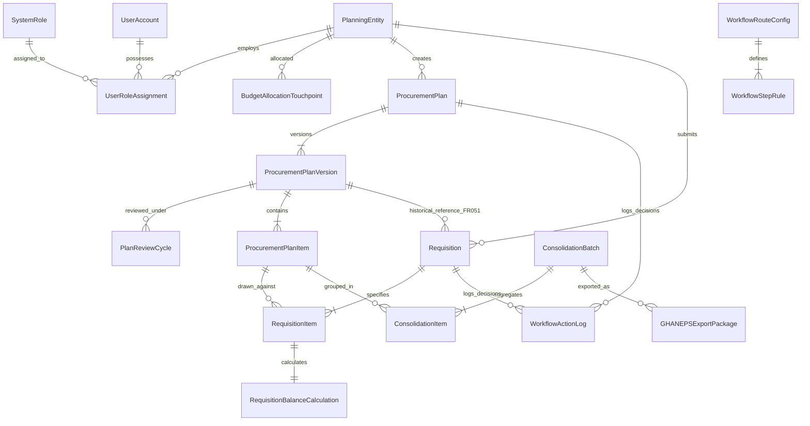

# PROMIS Conceptual Data Architecture Specification

## 1. Scope & Design Guardrails

### 1.1 Purely Conceptual Domain Model
This document defines the high-level **conceptual data architecture** and domain entity relationships for PROMIS. In strict compliance with project constraints:
- **No Physical Database Design**: This document contains **no SQL**, **no `CREATE TABLE` statements**, **no migrations**, **no index definitions**, and **no physical primary/foreign key implementations**.
- **Entity Definitions as Conceptual Domain Concepts**: Entities represent logical domain concepts and business objects rather than physical storage tables. They **must not be treated as final database tables**. Physical table structures, normalization, column types, and storage optimization will be determined in the subsequent Physical Database Design Phase.
- **Architectural Nature of Entity Count**: The grouping into 24 conceptual domain entities is an **architectural structural decomposition derived from the requirements**, NOT a University-provided fact or rigid constraint.
- **Distinction of Concepts**:
  - **CONFIRMED BUSINESS REQUIREMENT**: Tracking annual procurement plans, quarterly review outcomes, versioned plan revisions, plan-linked requisitions with quantity balance tracking, and institutional consolidation.
  - **PROPOSED ARCHITECTURAL DESIGN**: The conceptual modeling into these specific 24 entities and 7 logical clusters.

---

## 2. Conceptual Domain Entities

The PROMIS domain is organized into seven conceptual clusters encompassing 24 domain entities:

```
+-----------------------------------------------------------------------------------------+
|                                    PROMIS DOMAIN CLUSTERS                                |
+---------------------------+-----------------------------+-------------------------------+
| 1. Organizational & Master | 2. User & Access Control    | 3. Procurement Planning       |
|    - PlanningEntity       |    - UserAccount            |    - ProcurementPlan          |
|    - EntityType           |    - SystemRole             |    - ProcurementPlanVersion   |
|    - BudgetTouchpoint     |    - SystemPermission       |    - PlanReviewCycle          |
|                           |    - UserRoleAssignment     |    - ProcurementPlanItem      |
+---------------------------+-----------------------------+-------------------------------+
| 4. Requisitioning         | 5. Workflow & Routing       | 6. Consolidation & Export     |
|    - Requisition          |    - WorkflowRouteConfig    |    - ConsolidationBatch       |
|    - RequisitionItem      |    - WorkflowStepRule       |    - ConsolidationItem        |
|    - BalanceCalculation   |    - WorkflowActionLog      |    - GHANEPSExportPackage     |
+---------------------------+-----------------------------+-------------------------------+
| 7. Cross-Cutting          |                             |                               |
|    - AuditRecord          |    - DocumentAttachment     |    - SystemNotification       |
+---------------------------+-----------------------------+-------------------------------+
```

### 2.1 Cluster 1: Organizational & Master Data
1. **`PlanningEntity`**:
   - Represents one of the ~62 University operational units (Faculties, Departments, Directorates, Institutes, Centers).
   - **Architectural Principle**: Treated strictly as **configurable master data**. No hard-coded entity names, organizational hierarchies, codes, or approving officers.
   - Conceptual Attributes: Entity Name, Entity Code, Entity Type Reference, Parent Entity Reference (optional hierarchy), Operational Status.
2. **`EntityType`**:
   - Categorization of planning units (e.g., Central Administration, Academic Faculty, Academic Department, Research Institute, Service Directorate).
   - Conceptual Attributes: Type Name, Description.
3. **`BudgetAllocationTouchpoint`**:
   - Represents institutional budget allocations allocated to a planning entity for a given fiscal year.
   - Conceptual Attributes: Fiscal Year, Funding Source Description, Allocated Amount, Currency, Reference Code.

### 2.2 Cluster 2: User & Access Control
4. **`UserAccount`**:
   - An individual authenticated user within the University procurement ecosystem.
   - Conceptual Attributes: Username, Full Name, Institutional Email, Account Status, Password Credential Hash.
5. **`SystemRole`**:
   - Configurable organizational or system role (e.g., Entity Planning Officer, Head of Entity, Directorate Officer, Director of Procurement, Finance Officer).
   - Conceptual Attributes: Role Code, Role Title, Role Description.
6. **`SystemPermission`**:
   - Granular functional capability (e.g., `plan.create`, `plan.submit`, `plan.review`, `plan.approve`, `requisition.create`, `consolidation.execute`, `export.ghaneps`).
   - Conceptual Attributes: Permission Code, Description, Module Area.
7. **`UserRoleAssignment`**:
   - Associative relationship establishing which role(s) a user holds, scoped specifically to a `PlanningEntity`.
   - Conceptual Attributes: User Reference, Role Reference, Planning Entity Reference, Effective Date, Status.

### 2.3 Cluster 3: Procurement Planning & Versioning
8. **`ProcurementPlan`**:
   - The master annual procurement plan container for a Planning Entity for a specific fiscal year.
   - Conceptual Attributes: Fiscal Year, Planning Entity Reference, Current Lifecycle Status (`Draft`, `Submitted`, `Approved`, `Under Review`), Current Active Version Reference.
9. **`ProcurementPlanVersion`**:
   - Represents a specific approved version baseline or revised version of an entity's annual plan.
   - Conceptual Attributes: Version Number (e.g., `v1.0`, `v2.0`), Approval Date, Approving Authority Reference, Revision Reason, Is Active Flag.
   - **Business Requirement**: Historical approved procurement-plan versions shall be preserved and shall not be overwritten.
   - **Architectural Implementation**: Version history shall be preserved through a dedicated versioning structure; the exact physical database implementation will be determined during the Physical Database Design phase. Do not assume database immutability until the physical design and security model explicitly establish how historical records are protected.
10. **`PlanReviewCycle`**:
    - Captures quarterly review events (Q1, Q2, Q3, Q4) conducted on approved plans.
    - Conceptual Attributes: Quarter Indicator, Review Date, Reviewing Officer Reference, Review Determination (`No Change` vs. `Revision Required`), Review Notes.
11. **`ProcurementPlanItem`**:
    - An individual planned procurement line item within a specific plan version.
    - Conceptual Attributes: Item Description, Procurement Category (Goods, Works, Technical Services, Consulting), Estimated Total Cost, Planned Quantity, Unit of Measure, Planned Implementation Quarter, Funding Source Reference.

### 2.4 Cluster 4: Requisitioning & Balance Tracking
12. **`Requisition`**:
    - An operational procurement request submitted by an entity to initiate procurement against an approved plan.
    - Conceptual Attributes: Requisition Reference Number, Planning Entity Reference, Submission Date, Lifecycle Status (`Draft`, `Submitted`, `Endorsed`, `Approved`, `Rejected`), Associated Approved Plan Version Reference.
    - **FR-051 Rule**: Retains a historical reference to the approved procurement-plan version under which it was submitted; that historical association is never silently changed.
13. **`RequisitionItem`**:
    - Individual line item requested within a requisition.
    - Conceptual Attributes: Associated Plan Item Reference, Requested Description, Requested Quantity, Unit of Measure, Estimated Unit Cost, Justification.
14. **`RequisitionBalanceCalculation`**:
    - Conceptual calculation tracking allocation consumption for each requisition item.
    - **Conceptual Balance Model**:
      - `Approved Planned Quantity`
      - `Previously Requested Quantity`
      - `Current Request Quantity`
      - `Remaining Before Current Request` = `Approved Planned Quantity` - `Previously Requested Quantity`
      - If approved: `Remaining After Current Request` = `Remaining Before Current Request` - `Current Request Quantity`

### 2.5 Cluster 5: Workflow & Routing Architecture
15. **`WorkflowRouteConfig`**:
    - Configured routing definition governing how a document type flows through approval authorities.
    - Conceptual Attributes: Document Type (`ProcurementPlan`, `Requisition`, `QuarterlyRevision`), Entity Type Scoping, Active Flag.
16. **`WorkflowStepRule`**:
    - An ordered stage within a routing path.
    - Conceptual Attributes: Step Sequence Order, Step Name (e.g., `Head of Department Approval`, `Finance Commitment Authorization`, `Procurement Verification`), Required Role / Authority, Stage Condition Rules.
17. **`WorkflowActionLog`**:
    - Immutable audit record of a human workflow decision.
    - Conceptual Attributes: Document Reference, Step Reference, Action Taken (`Approve`, `Reject`, `Return for Correction`, `Endorse`), Action Date, Acting User Reference, Comments / Decision Justification.

### 2.6 Cluster 6: Consolidation & GHANEPS Export
18. **`ConsolidationBatch`**:
    - Institutional consolidation package compiled by the Procurement Directorate across entities.
    - Conceptual Attributes: Fiscal Year, Batch Reference, Compilation Date, Consolidated Scope, Consolidation Status.
19. **`ConsolidationItem`**:
    - Mapping associating individual entity plan items into institutional procurement packages.
    - Conceptual Attributes: Batch Reference, Source Plan Item Reference, Package Assignment Code.
20. **`GHANEPSExportPackage`**:
    - Metadata recording an exported institutional plan file package.
    - Conceptual Attributes: Export Timestamp, Compiling Officer Reference, Batch Reference, Export Format (Format TBC), Checksum / Hash, Export Log Notes.

### 2.7 Cluster 7: Cross-Cutting Supporting Entities
21. **`AuditRecord`**:
    - Protected institutional audit log capturing security, administrative, and financial events.
    - Conceptual Attributes: Event Timestamp, User Reference, Action Name, Entity Type, Entity Reference ID, IP Address, Pre-Change State Snapshot, Post-Change State Snapshot.
    - **Rule**: Protected from unauthorized modification or deletion.
22. **`DocumentAttachment`**:
    - Metadata representing uploaded supporting documents.
    - Conceptual Attributes: Storage Identifier Reference (UUID as proposed approach), Original Filename, File Size, MIME Type, Associated Document Reference, Upload Timestamp, Uploading User Reference.
23. **`SystemNotification`**:
    - In-system alert for workflow events.
    - Conceptual Attributes: Recipient User Reference, Alert Subject, Alert Message, Generated Timestamp, Read Status.

---

## 3. Conceptual Entity Relationships & Cardinality



### 3.1 Key Conceptual Cardinalities
- **`PlanningEntity` to `ProcurementPlan`**: `1 to N` (One plan per fiscal year per entity).
- **`ProcurementPlan` to `ProcurementPlanVersion`**: `1 to N` (Initial approved version plus subsequent quarterly revisions).
- **`ProcurementPlanVersion` to `ProcurementPlanItem`**: `1 to N` (Line items belong to a specific plan version).
- **`ProcurementPlanVersion` to `Requisition` (FR-051)**: `1 to N` (Requisitions link historically to the specific approved plan version active at submission; historical link is never silently changed).
- **`ProcurementPlanItem` to `RequisitionItem`**: `1 to N` (Multiple requisitions may draw from the same plan line item up to available balance).
- **`ProcurementPlanItem` to `ConsolidationItem`**: `1 to N` (Plan items across multiple entities consolidated into institutional lots).
- **`ConsolidationBatch` to `GHANEPSExportPackage`**: `1 to N` (Multiple export snapshots can be generated from an institutional consolidation batch).

---

## 4. Architectural Summary
The conceptual data model establishes clear entity boundaries, explicit tracking of quarterly plan versions, preservation of historical requisition-to-version linkages (FR-051), and a transparent conceptual balance model. All physical schema design (SQL, tables, migrations, data types, physical foreign keys) is strictly reserved for the subsequent Physical Database Design Phase.
