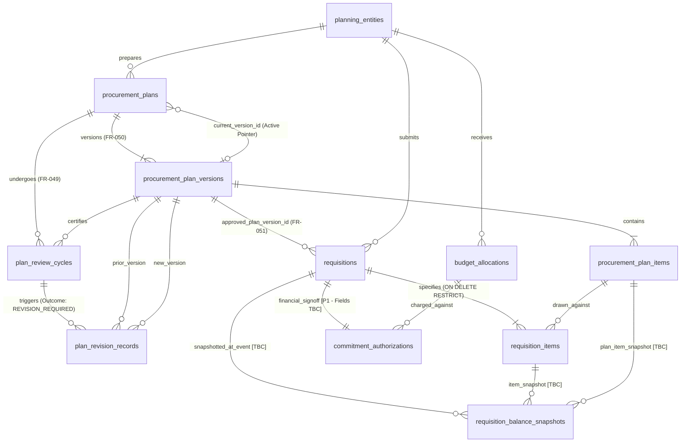
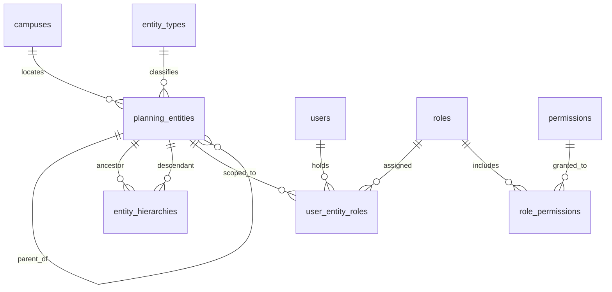
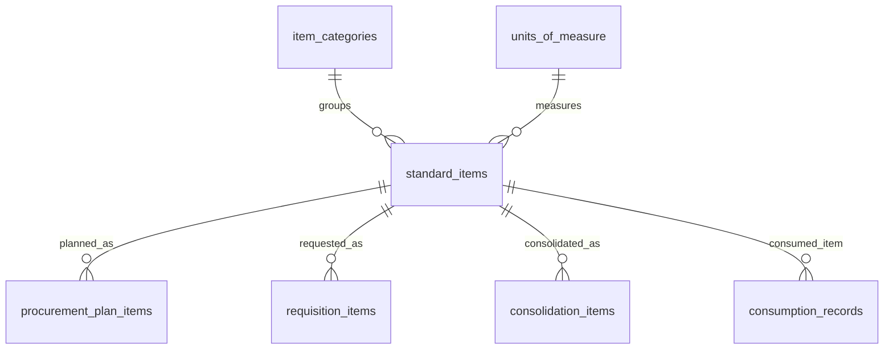
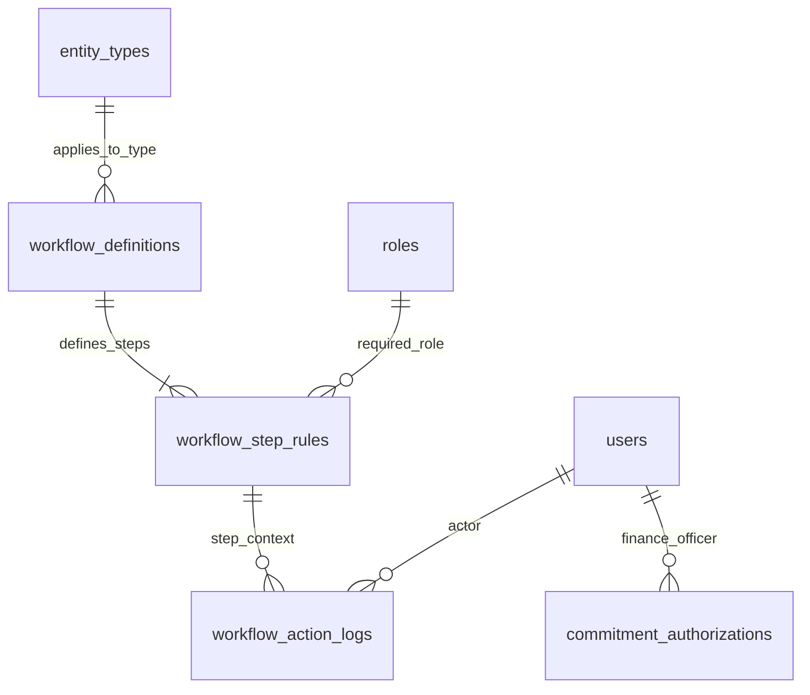
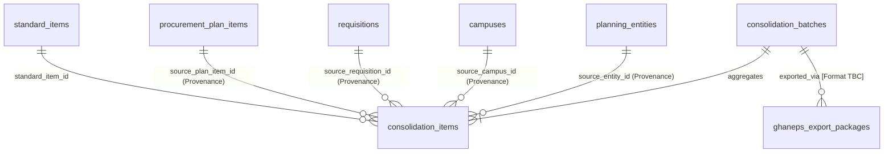
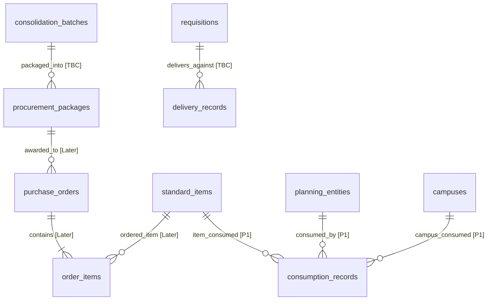
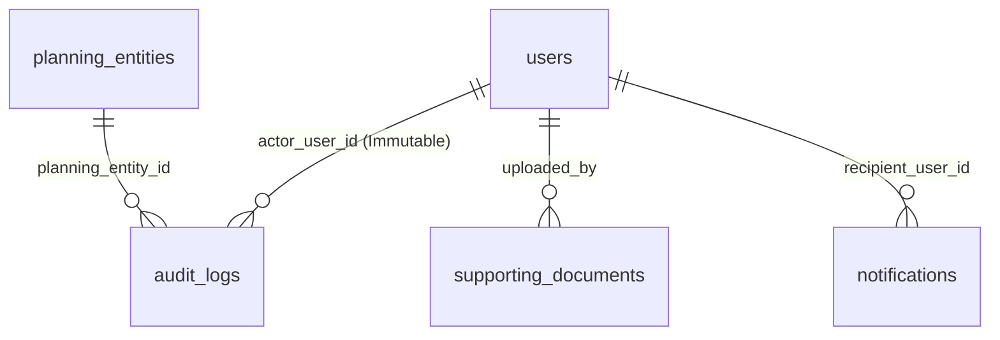

# PROMIS Physical Entity-Relationship Diagrams

## 1. Overview & Diagram Architecture
This document provides the complete set of physical Entity-Relationship (ER) diagrams for all **36 physical tables** in PROMIS, illustrating relational cardinalities, foreign key references, and provenance linkages across all 11 functional clusters.

### Phased Classification Summary
- **Phase 1 (31 Tables)**: Core identity, organizational structure, standard catalogue, annual planning, versioning, plan-linked requisitions, workflow, consolidation, consumption, protected audit, and notifications.
- **To Be Confirmed (3 Tables)**: `requisition_balance_snapshots`, `procurement_packages`, `delivery_records`.
- **Proposed Later Phase (2 Tables)**: `purchase_orders`, `order_items`.

All foreign key relationships enforce `ON UPDATE RESTRICT` reflecting the immutability of synthetic surrogate keys (`AUTO_INCREMENT`).

---

## 2. Core Domain Relationships: Planning, Versioning & Requisitions

This diagram illustrates how annual plans, quarterly review cycles (FR-049), versioning (FR-050), and plan-linked requisitions (FR-051) are physically linked while preserving historical associations:

### Key Architectural Characteristics
1. **Active Plan Version Single Source of Truth**: `procurement_plans.current_version_id` is the sole authoritative pointer to the active approved plan version (`ON DELETE RESTRICT ON UPDATE RESTRICT`). Column `is_current_active` is eliminated to avoid dual-source-of-truth divergence in MySQL.
2. **FR-049 Quarterly Review Cycles & Invariants**: A quarterly review certifies the active plan version (`NO_CHANGE` or `REVISION_REQUIRED`). A composite foreign key `(active_version_id, procurement_plan_id) REFERENCES procurement_plan_versions(id, procurement_plan_id)` physically prevents evaluating a version belonging to another plan.
3. **FR-050 Plan Versioning & Revisions**: Historical approved versions are preserved and never overwritten. `plan_revision_records` links `prior_version_id` and `new_version_id` with composite FKs ensuring both versions belong to the same plan root.
4. **FR-051 Plan Version Association (Nullability TBC)**: Requisitions reference `procurement_plan_versions` directly via `approved_plan_version_id INT UNSIGNED NULL` with `ON DELETE RESTRICT ON UPDATE RESTRICT`. When Version 2.0 is published, existing requisitions remain permanently anchored to Version 1.0. Nullability remains TBC/proposed pending confirmation of plan-link exclusivity.
5. **Requisition Items Deletion Safety**: `requisition_items.requisition_id` enforces `ON DELETE RESTRICT` preventing engine-level cascade deletions. Draft line items are safely managed by the application Service Layer inside a transaction strictly when `status = 'DRAFT'`.
6. **Requisition Balance Calculation vs. Snapshot**:
   - Operational balance calculation is dynamic in real time:
     $$\text{Remaining Before} = \text{Approved Planned Quantity} - \text{Previously Requested Quantity}$$
     $$\text{Remaining After} = \text{Remaining Before} - \text{Current Request Quantity}$$
   - `requisition_balance_snapshots` (Status: `TBC`) captures historical evidence at submission/commitment events and must never become an alternative operational truth.

---

## 3. Organizational Structure & Identity (Entity-Scoped RBAC)

This diagram models the ~62 planning entities, multi-campus physical structure, recursive entity hierarchies, and entity-scoped role-based access control:

### Key Architectural Characteristics
- Zero University-specific organizational records (entities, campuses, entity types, user roles) are hard-coded in the database schema.
- `user_entity_roles` enforces entity-scoping: a user holds a specific role strictly within a specific planning entity.
- `entity_hierarchies` is a closure table supporting recursive traversal of academic/administrative departments up to faculties and central administration.

---

## 4. Standard Catalogue & Planning Items

---

## 5. Configurable Workflow Routing & Approvals

### Key Architectural Characteristics
- Configurable approval routing per document type and entity type.
- Approval monetary thresholds in `workflow_step_rules` (`threshold_min_amount`, `threshold_max_amount`) are configurable master data; zero statutory thresholds are hard-coded.
- `workflow_action_logs` is an append-only decision record; zero `updated_at`/`updated_by`.

---

## 6. Institutional Demand Consolidation & GHANEPS Handover

This diagram illustrates how departmental requisitions are consolidated into institutional tender packages while strictly preserving departmental, campus, and line-item provenance:

### Key Architectural Characteristics
- Complete provenance preservation: Every consolidated item directly references the originating planning entity, campus, requisition, and annual plan line item.
- `ghaneps_export_packages` records information handover metadata; the technical transfer format remains `TO BE CONFIRMED`.

---

## 7. Downstream Operations: Procurement Packages, Orders & Delivery

This diagram shows downstream procurement operations and their strict phasing separation:

### Key Architectural Characteristics
- `procurement_packages` (Status: `TBC`) represents tender packaging at the Directorate level; not expanded into Phase 1 operations.
- `purchase_orders` and `order_items` are classified as `PROPOSED LATER PHASE`.
- `delivery_records` (Status: `TBC`) captures goods receipts and waybill references.
- `consumption_records` (Status: `CONFIRMED PHASE 1`, FR-042) captures quarterly departmental consumption data for demand forecasting.

---

## 8. Protected Institutional Audit, Supporting Documents & Notifications

### Key Architectural Characteristics
- `audit_logs` is an append-only protected forensic trail with pre-change and post-change JSON snapshots.
- Application database accounts have zero `UPDATE` or `DELETE` privileges on `audit_logs`.
- Single immutable event timestamps are used; no generic update timestamps.
